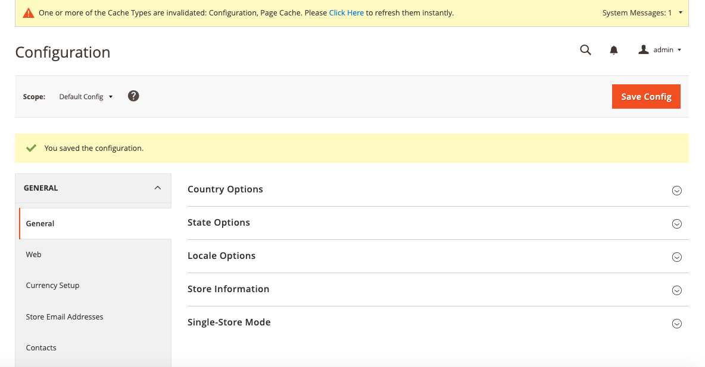
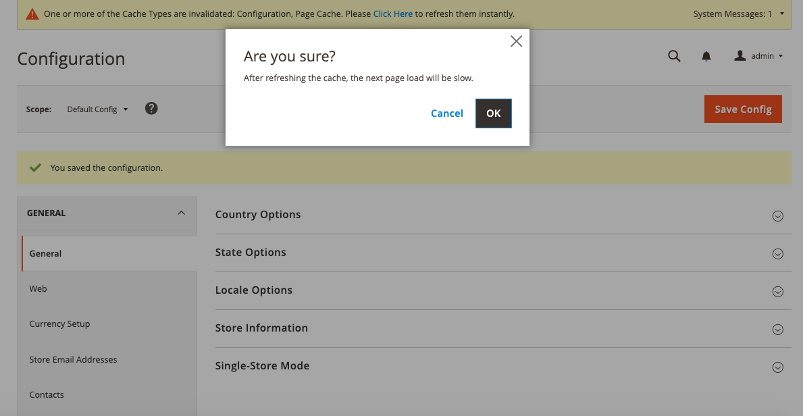
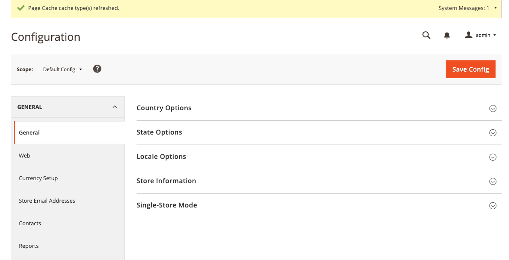
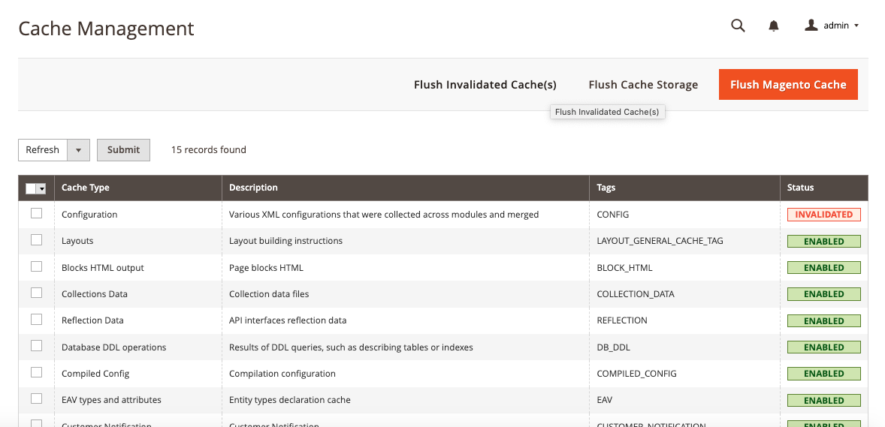
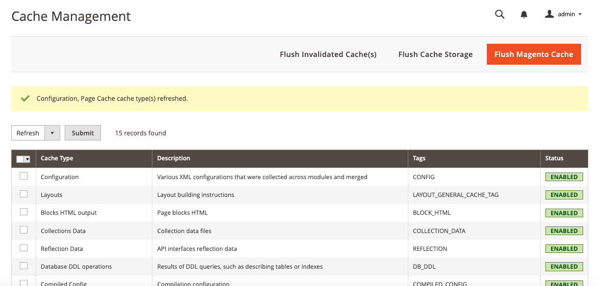

# Magento 2 Quick Cache Clean

## Table of contents

- [Summary](#summary)
- [Installation](#installation)
- [Detail Information](#detail-information)
- [License](#license)

## Summary

The Magento 2 "Quick Cache Clean" extension will allow admin user to refresh the invalidated Magento 2 cache(s) instantly without navigating to **System > Cache Management** page.

## Installation

You can install the Extension using one of two methods:
 1. Via Composer 
 2. By downloading it directly from the available source.
 
### 1. Install via composer

To install the Extension via Composer, follow these steps in your Magento 2 root folder:

Run the following command:
```shell
composer require mdbhojwani/magento2-quick-cache-clea
```
After a successful installation, execute the following commands:

```shell
php bin/magento setup:upgrade
php bin/magento setup:static-content:deploy -f
php bin/magento c:c
```

With these steps completed, you'll be ready to utilize the Extension.

### 2. Download Directly

To install the Mdbhojwani Save For Later Extension you can download the Extension from below link:

https://github.com/mdbhojwani/magento2-quick-cache-clea

After successfully downloading the module, follow these steps to install it:

1. Unzip the downloaded folder.

2. Place the unzipped extension folder into the following path:

```shell
project-root-directory/app/code/Mdbhojwani/QuickCacheClean
```

Indeed, after placing the extension folder in the specified directory, follow these Magento commands to complete the installation:
```shell
php bin/magento setup:upgrade
php bin/magento setup:static-content:deploy -f
php bin/magento c:c
```

By following these 2 Ways you can easily obtain and install the module. For detailed instructions on its usage, refer to the user guide within this document.


## Detail Information

Once a cache is invalidated, a link to refresh the cache will appear in the admin top notification bar. You simply need to click the link, and confirm.

**Cache Invalidate Screen**
<div>
    
</div>

**Cache Clean Confirmation Screen**
<div>
    
</div>
<br/>
**Cache Clean Message Screen**
<div>
    
</div>
<br/><br/>

Additionally, you can find the **Flush Invalidated Cache(s)** button under **System > Cache Management** page to refresh the invalidated cache(s) with a single click.

**Cache Invalidate Screen**
<div>
    
</div>
<br/>

**Cache Clean Message Screen**
<div>
    
</div>


## License

[Open Software License ("OSL") v. 3.0](https://opensource.org/license/osl-3-0-php)

